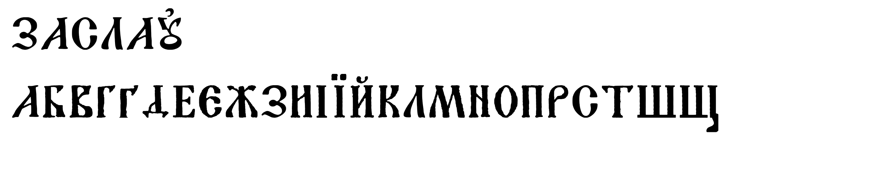

# Zaslav Display

Hand-drawn Belarusian Cyrillic display typeface, work in progress.

Traced from the "ЗАСЛАЎ" logo and a historic Cyrillic specimen sheet, then
built into real font files with [fontTools](https://github.com/fonttools/fonttools).



## Status

**v1.8 — 30 uppercase letters + Ꙗ:**

```
А Б В Г Ґ Д Е Є Ж З И І Ї Й К Л М Н О П Р С Т Ў Ч Ш Щ Ь Ю Я Ꙗ
```

`Ш`, `Щ` and `Ч` weren't in either source image — they're constructed from
the same stem/serif shapes as `І`. `Щ`'s descender tail and `Ч`'s bowl were
drawn to match a reference the user provided, then everything is run through
the same trace pipeline as the rest of the glyphs for a consistent texture.

The font also has a `space` glyph (280 units, mapped to U+0020 and U+00A0),
so spaces in running text come from the font instead of a fallback.

Kerning: 295 pairs in a GPOS `kern` feature, source in `kern.fea`
(РА, ТА, ГА, ЗА, АТ, АЧ, ДЕ, ТО…). Browsers apply it automatically.

`Е` was redrawn from a small photo reference (about 20 px tall, too small to
trace directly): heavy straight stem without left serifs, hairline arms, a
teardrop beak at the top, a tall thin spur on the middle arm and a wedge at
the bottom. It was rebuilt at high resolution and run through potrace with a
light edge roughening so its texture matches the traced glyphs.

`Ю` is constructed as well: the `І` stem and the `О` bowl joined by a short
bracketed crossbar at mid-height; only the bar was roughened, the stem and
bowl keep their traced outlines.

`Ь` is built from the top of `І` (stem with both serifs) and the lower bowl
of `В`, joined with a curved bracket where the bowl meets the stem.

`Ꙗ` (iotified A, U+A656; lowercase `ꙗ` U+A657 maps to the same glyph) is
the `І` stem and `А` joined by a crossbar that runs into the diagonal of `А`,
with a small gap left between the feet at the baseline.

`Я` follows the handwritten я of Bohdan-Ihor Antonych (his «ся» and «Ясна»)
on the left and `А` on the right. Left: a loop that starts with a hanging
drop, a small eye where the pen crosses its own stroke, and a leg ending in
a heavy rounded drop at the baseline. Right: the whole right stem of `А`
(flagged head with its full beak, foot) and the `А` crossbar, extended along
its own slope until it meets the leg. Built from the mirrored `Р` bowl, the
left leg of `Л` and `А`.

Still missing: `У Ф Х Ц` and all lowercase letters.
More glyphs get added as source material comes in.

## Files

- `ZaslavDisplay-Regular.otf` — desktop / general use
- `ZaslavDisplay-Regular.ttf` — for apps/platforms that need TrueType outlines
- `ZaslavDisplay-Regular.woff2` — for the web
- `zaslav-display.css` — ready `@font-face` snippet
- `demo.html` — quick browser preview

## Use on the web

```css
@font-face {
  font-family: "Zaslav Display";
  src: url("ZaslavDisplay-Regular.woff2") format("woff2"),
       url("ZaslavDisplay-Regular.otf") format("opentype");
  font-weight: 400;
  font-style: normal;
  font-display: swap;
}

.zaslav {
  font-family: "Zaslav Display", serif;
}
```

## Use in an app

Bundle `ZaslavDisplay-Regular.ttf` (or `.otf`) as a normal custom font asset
for your platform (iOS/Android/Flutter/etc.) and reference it by its family
name, `Zaslav Display`.
